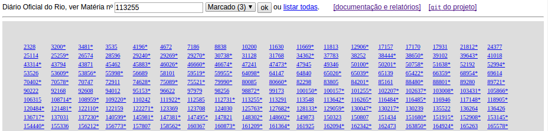
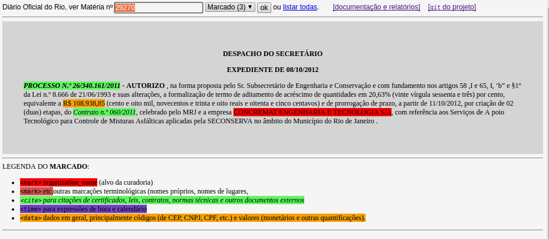

# Demo

Demonstração de um processo de uso real do QueriDO, 
disponível em [**okfn-brasil.github.io/queriDO**](https://okfn-brasil.github.io/queriDO), 
baseada no material levantado pela [curadoria-1](reports/curadoria001.md).
A ilustração abaixo mostra a tela incial do site. 

É apresentada a listagem de códigos de matéria relativos aos documentos originais trazidos do DOM-RJ. 
Você pode digitar um código ou clicar na listagem. Então vai aparecer o conteúdo da matéria, como no exemplo abaixo.

Esse conteúdo pode ser visualizado nos três modos, "original", "filtrado" ou "marcado", 
conforme [explicação do tratamento primário](index.md#tratamento-primario).

A legenda abaixo do conteúdo marcado indica os tipos mais gerais de marcação.

