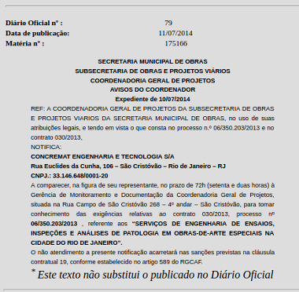
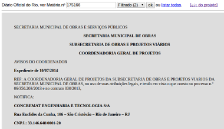
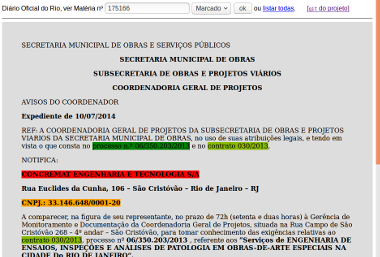
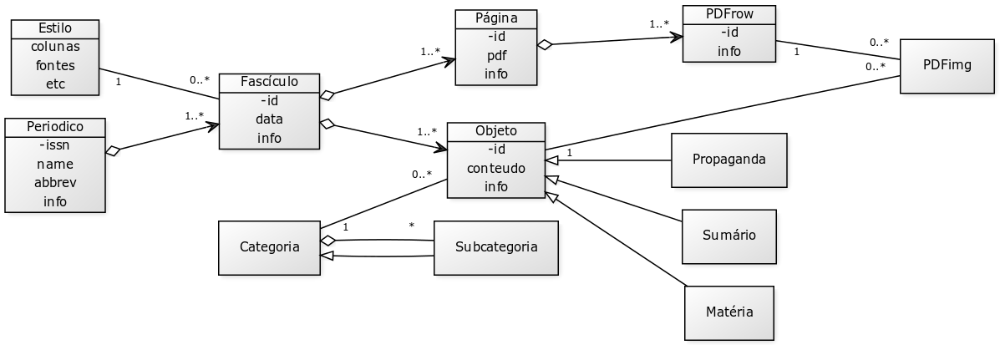
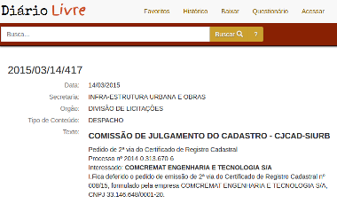

# Documentação

A metodologia do Projeto QueriDO enfatiza o uso de [*curadorias*, conforme seu regulamento](curadorias), e a coordenação de *experts* voluntários em torno do apoio a essas curadorias.

A estruturação do Projeto QueriDO teve seu foco na gestão e preservação dos *relatórios* das curadorias 
e num *banco de dados* das matérias trazidas dos Diários Oficiais.

Quem traz as matérias originais é o [*módulo TrazDia*](trazdia-uso), e então elas são preservadas no *Github* na pasta `content/original`. Em seguida os processos são assistidos:  quem faz a filtragem e reestruturação são os *módulos CleanDoc e StrutDoc*, e quem faz a marcação final é o *módulo MarkDoc*. Se por acaso um desses passos requerer intervenção humana, o resultado da intervenção é registrado no *Github*, complementando o `content/original`. Todo o restante, automatizado, é mantido em no banco de dados. As ferramentas do *módulo de Pesquisa* no banco de dados também permitem extração automatica de dados, gerando planilhas e outros formatos de dados para análise ou registro na forma de relatório.

Por fim, os relatórios redigidos pela curadoria são armazenados na pasta [`report`](https://github.com/okfn-brasil/queriDO/tree/master/docs/reports).

## Tratamento primário

Registro da matéria original, sua filtragem e marcação.

* Passo-1: obter e conferir o original. O *módulo TrazDia* faz isso automaticamente.  

* Passo-2: filtrar. Em geral será automático sem necessidade de intervenção). 

* Passo-3: marcar. As regras de marcação precisam ser revisadas pela curadoria, e eventualmente algumas marcações precisam ser feitas manualmente.  

## Repositório QueriDO

No diagrama abaixo são representados todos repositórios, incluindo bancos de dados, repositórios de datasets e de conteúdos.
 
&nbsp;&nbsp;&nbsp;

O "*estatuto*" e os *relatórios* gerados pelas curadorias, assim como os documentos copiados das matérias originais nos diários oficiais, 
são todos armazenados em repositório [*git*](https://en.wikipedia.org/wiki/Git). Em particular as cópias dos originais recebem 
[certificado de integridade para preservação de longo prazo](https://github.com/okfn-brasil/discussOKBr-assets/wiki/Checksums).

A base de dados (SQL) foi estruturada conforme o seguinte molelo de classes (UML): 

Onde se destaca a opção de armazenamento das matérias dos diários oficiais em seu formato ideal estruturado (XHTML), ou, 
na ausência de uma oferta oficial de HTML, seu PDF serializado em tabelas (PDFrow). 

Cada diário é composto de seus fascículos, e cada fascículo, quando estruturado, composto de seus objetos de conteúdo, 
que são tipicamente as matérias. A estrutura de categoriais permite expressar blocos tais como seções, subseções, capítulos, etc.
Todos os campos `info` são estruturas JSON (tipicamente metadados) também padronizadas pelo modelo de dados. 
Os conteúdos de matéria em inteiro teor são campos XML, e as imagens podem tanto ser armazenadas em filesystem (URL local ou apontando para service como [AMS Glacier](https://aws.amazon.com/pt/glacier/)) como em SQL (*blob* ou *bytea*).

## Módulos do QueriDO

...módulos de *back-end* e de *front-end*... Ver [ferramentas](ferramentas).

## Busca em outros diários

A organização dos materiais é feita a cada Diário Oficial, mas pode-se compor um relatório mais amplo vinculando duas curadorias de diários distintos.

